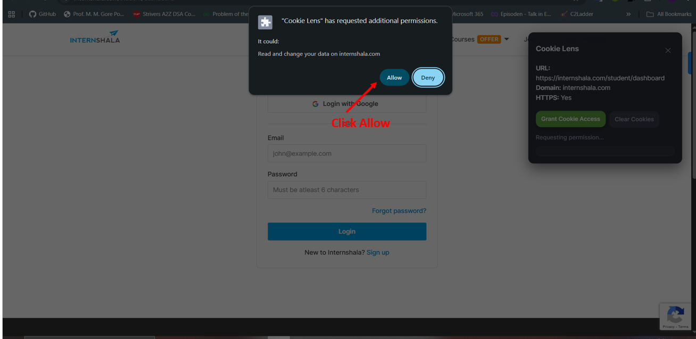

# Cookie Lens

A secure, lightweight Chrome extension that shows webpage URL, domain, HTTPS status, and cookies with runtime permission requests.

---
## Demo

**Video Demo:-** [watch](https://drive.google.com/file/d/1QtZlDEdDzcTe8hrOQQ3r521HNZwK8mlz/view?usp=sharing)

---

## Features

- **cookie access**: Request cookie permissions at runtime without granting global access.  
- **Live cookie monitoring**: Automatically updates cookies in real-time when they change.  
- **Overlay interface**: Easy-to-use overlay for managing cookies directly on the page.  
- **Clear cookies**: Delete all cookies for a specific domain in a single click.  
- **Lightweight & secure**: Only requests cookie permissions when needed.  

**⚠ Note:** Runtime revocation of cookie permissions per domain is a planned feature. Despite multiple attempts, this optional functionality is not fully supported due to Chrome API limitations. All other features work as expected.

---

## Installation

1. Clone or download this repository.
2. Open Chrome and navigate to `chrome://extensions/`.
3. Enable **Developer mode** in the top-right corner.
4. Click **Load unpacked** and select the folder containing the extension files.
5. The Cookie Lens icon should appear in your toolbar.

---

## Usage

1. Navigate to any website.
2. Click the **Cookie Lens toolbar icon**.
3. The overlay panel appears with options to:  
   - **Grant Cookie Access** – Request permission to access cookies for the current domain.  
   - **Show Cookies** – Display all cookies for the domain.  
   - **Revoke Access** – Intended to remove cookie access permission (currently limited).  
   - **Clear Cookies** – Delete all cookies for the domain.  
4. The list of cookies updates automatically whenever a cookie changes.

---

## Permissions

- **Optional Permissions:**  
  - `cookies` – Requested at runtime per domain.
- **Host Permissions:**  
  - Dynamically requested per domain when needed.  
- **Other Permissions:**  
  - `scripting` – Injects content script.  
  - `activeTab` – Access current active tab for overlay functionality.

---

## Screenshots

